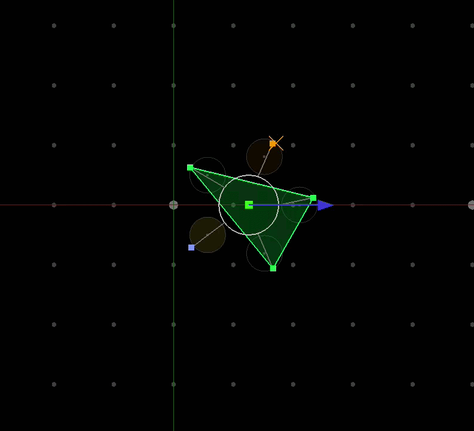

# Tripod-Gait Locomotion via Hierarchical Control and Deep Reinforcement Learning

A real-time simulation of a five-legged planar robot that learns stable locomotion
through a deliberate decomposition of the control problem: classical control handles
continuous body dynamics, while a learned policy handles discrete gait decisions.

---



---

## Motivation and Design Philosophy

Teaching a legged robot to walk is hard partly because the problem conflates two
very different sub-problems: *how to keep the body moving smoothly* and *where to
put the next foot*. End-to-end RL approaches must discover both simultaneously,
which slows learning and produces policies that are difficult to interpret.

This project explores a hierarchical decomposition that separates the two cleanly:

- A **PD controller** runs at the physics rate and is responsible for all continuous
  dynamics, tracking a commanded velocity and heading via forces and torques applied
  to the rigid body.
- An **RL policy** runs once per footfall and is responsible for all discrete gait
  decisions, which of the three stance legs to retire and where to place the next
  foot.

The policy never needs to learn dynamics. It only needs to learn geometry: how to
arrange feet so the robot stays balanced while progressing toward its goal.

---

## Physical Model

The robot body is modelled as a **rigid disc** (mass 2 kg, rotational inertia 0.5
kg·m²) in the horizontal plane. Its state is the tuple (x, y, θ, ẋ, ẏ, θ̇). Five
legs are attached at 72° intervals; at every instant exactly three are in ground
contact.

**Stance mechanics.** Each grounded foot is anchored to the world via a spring-damper
(K = 500 N/m, D = 30 N·s/m). The natural frequency is ωₙ ≈ 15.8 rad/s with a
damping ratio ζ ≈ 0.47 : slightly under-damped, which keeps the body responsive
without oscillation. The spring displacement is zero when the body is exactly above
the foot anchor; any translation or rotation creates restoring force and torque.
This means the stance triangle passively resists perturbations with no active leg
control.

**PD layer.** A translational PD force drives body velocity toward a commanded
reference vector. A two-stage angular PD computes a reference spin rate from the
heading error (angle between body x-axis and commanded velocity direction), then
applies torque to track that spin rate. This gives the robot automatic heading
alignment without any involvement from the RL policy.

**Integration.** The equations of motion are integrated with RK4 at Δt = 5 ms,
giving a stability margin well above the spring's critical timestep. Python training
uses forward Euler (stable at this timestep, and 4× faster), while the C++ runtime
uses RK4 for trajectory fidelity.

---

## Gait Architecture

The gait is a strict **tripod**: three legs always on the ground, one swinging to a
new target, one idle (recently retired, waiting for the next cycle). This is
enforced as a hard structural constraint, not something the policy must discover.

One RL decision fires per landing event (every 0.2 s):

1. **Which stance leg to retire** (discrete, 3 choices)
2. **Where to place the next foot** (continuous, 2D offset)

The foot placement is constrained to a circular zone centered along each leg's mount
direction (radius 0.30 m at 0.85 m from body centre). The five zones are
geometrically separated (≥ 0.40 m gap between adjacent zone boundaries) and cannot
overlap regardless of what the policy outputs. This eliminates a large class of
physically meaningless actions from the search space.

---

## Stability Representation

A key design decision is how to make the *stability consequence of each choice*
legible to the policy at decision time, rather than letting the policy discover it
through experience.

For each of the three possible retire choices r ∈ {0, 1, 2}, the observation
includes the **prospective stability margin**: the minimum signed distance of the
body's centre of mass from the edges of the triangle that would be formed by
retiring leg r and adopting the just-landed leg. A positive value means the CoM
lies strictly inside the new support triangle; a negative value means the robot
would immediately become unstable. These three scalars are computed analytically and
included directly in the 17-dimensional observation vector.

This makes the retire decision interpretable: the policy can learn to associate
large positive margins with safe choices and avoid negative margins, and the
post-decision reward directly reinforces this via the margin of the chosen triangle.
A hard safety override in the C++ runtime rejects any choice with a negative margin,
guaranteeing physical feasibility even from a suboptimal policy.

---

## Observation and Action Spaces

**Observation (17-dimensional):**

| Elements | Meaning |
|---|---|
| `vx_b/2, vy_b/2` | Body velocity in body frame, normalised |
| `rvx/0.6, rvy/0.6` | Reference velocity in body frame, normalised |
| `s0x/R … s2y/R` | Three current stance foot positions (body frame / reach) |
| `lx/R, ly/R` | Just-landed foot position |
| `ix/R, iy/R` | Idle foot position |
| `pm0, pm1, pm2` | Prospective stability margins for each retire choice |

All foot positions are expressed in the body frame (so the observation is
heading-invariant) and normalised by the maximum leg reach R ≈ 1.47 m.

**Action (5-dimensional, continuous):**

| Elements | Meaning |
|---|---|
| `r0, r1, r2` | Retire logits : argmax selects which stance leg to lift |
| `tx, ty` | Foot placement offset within the idle leg's zone (unit disc) |

---

## Training

Training uses **PPO** (Proximal Policy Optimization) with a separate, wider value
network (`[256, 256, 128]`) and a standard policy network (`[128, 128]`). Reward
normalization via a running return estimator (`VecNormalize`) is essential: without
it the value function fails to fit the large accumulated returns and explained
variance collapses to zero.

The reward has two components: a dense per-substep term rewarding velocity tracking
accuracy (`exp(−5 · ‖v − v_ref‖²)`), and a sparse per-landing term rewarding the
prospective margin of the chosen retire configuration. The reference velocity
direction and magnitude are randomised each episode (speed 0.2–0.5 m/s, heading
uniform over S¹), encouraging direction-agnostic gait.

Convergence to stable directional locomotion occurs within approximately 500 000
environment steps on a laptop CPU.

---

## Runtime

The trained policy is exported to **ONNX** and loaded in C++ via ONNX Runtime for
inference. The visualisation uses OpenGL (GLEW + GLFW). The interactive simulation
runs in real time with 3 physics substeps per rendered frame.

**Controls:**

| Key | Effect |
|---|---|
| `← / →` | Rotate reference velocity direction |
| `↑ / ↓` | Increase / decrease reference speed |
| `SPACE` | Stop |

---

## Project Structure

```
.
├── main.cpp                  # Render loop, input handling, RL inference call
├── src/
│   ├── robot-from-above.cpp  # Physics, kinematics, observation builder
│   ├── robot-from-above.h
│   ├── constants.cpp         # All physical and geometric constants
│   ├── constants.h
│   ├── RLwalking.cpp         # ONNX Runtime wrapper
│   ├── RLwalking.h
│   └── rl_policy.onnx        # Exported policy network
├── RLwalkingtraining.py      # Gymnasium environment + PPO training + ONNX export
└── CMakeLists.txt
```

---

## Dependencies

- C++17
- OpenGL, GLEW, GLFW3, GLM
- ONNX Runtime (bundled under `src/onnxruntime-linux-x64-gpu-*/`)
- Python: `gymnasium`, `stable-baselines3`, `torch`, `numpy`

**Build:**
```bash
mkdir build && cd build
cmake ..
make -j$(nproc)
./FiveLeggedRobot
```

**Train:**
```bash
python3 RLwalkingtraining.py
```
